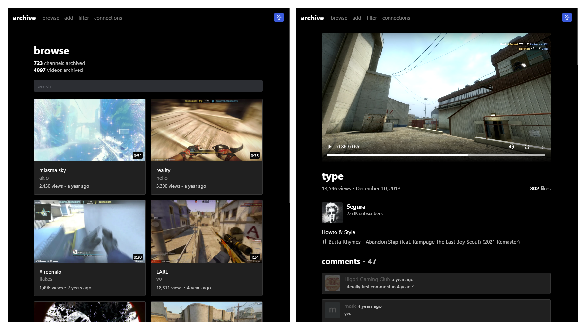

# YouTube Archiver - Client

An application built to archive YouTube content and rehost it inside a clean modern interface.

[Server repository](https://github.com/f0e/youtube-archiver-server)

### Channel Discovery

The application discovers new content creators by automatically scraping the comments of archived videos to find frequent commenters, and then adds those channels to a queue. This queue is sorted by the amount of comments, with the logic being the most frequent commenters are most likely to be a part of the community of creators you're archiving. From there, you can go through the queue and preview each creator's videos and accept or reject them. The accepted creators then get parsed, downloaded and their commenters scraped, continuing the cycle.

## Requirements

- [Node.js](https://nodejs.org/en/)
- [Yarn](https://classic.yarnpkg.com/lang/en/docs/install/#windows-stable)

## Setup

1. Install the [requirements](#requirements)
2. Run `yarn`

## Running

1. Run `yarn start`
2. Start the [server](https://github.com/f0e/youtube-archiver-server)
